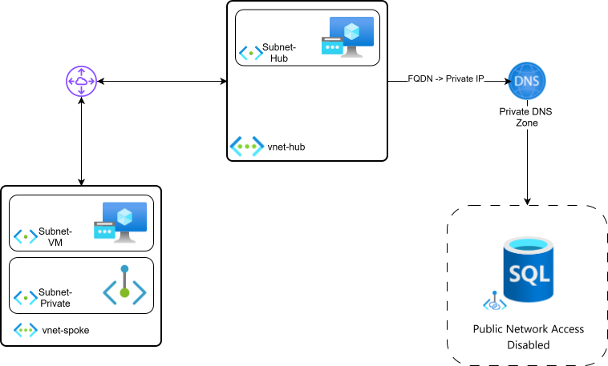

# Lab 01 – Azure SQL Private Endpoint with Hub-Spoke Networking

## Objective

The objective of this lab is to validate private connectivity to an **Azure SQL Database (PaaS)** using a **Private Endpoint**, resolving the service via **FQDN**, inside a **Hub-Spoke network topology**.

The workload will connect to Azure SQL **without using public network access**, ensuring traffic remains on the Microsoft backbone network.

---

## Architecture Overview

This lab uses a **Hub-Spoke architecture** with centralized DNS resolution.



---

## Architecture Components

### Hub Virtual Network (vnet-hub)

- Centralized networking services
- Hosts the **Private DNS Zone**
- Acts as shared infrastructure for workloads

Components:
- Virtual Network: `vnet-hub`
- Private DNS Zone:
  - `privatelink.database.windows.net`
- VNet Peering:
  - Hub → Spoke (gateway transit enabled)

---

### Spoke Virtual Network (vnet-spoke)

- Hosts the workload that consumes Azure SQL

Components:
- Virtual Network: `vnet-spoke`
- Subnet: `Subnet-VM`
  - Windows Virtual Machine
  - SQL Server Management Studio (SSMS)
- Subnet: `Subnet-PrivateEndpoint`
  - Azure Private Endpoint (SQL)

---

### Azure SQL (PaaS)

- Azure SQL Server
- Azure SQL Database
- **Public Network Access: Disabled**
- Connected via **Azure Private Link**

---

## Network Flow

1. The VM in the Spoke initiates a connection to:
<sql-server-name>.database.windows.net</sql-server-name>

2. DNS Resolution:
- Public DNS returns a CNAME pointing to:
  ```
  <sql-server-name>.privatelink.database.windows.net
  ```
- The query is resolved using the **Private DNS Zone** in the Hub
- The Private DNS Zone returns the **private IP address** of the Private Endpoint

3. Traffic Flow:
- VM → Private Endpoint (private IP)
- Private Endpoint → Azure SQL (Private Link)
- No traffic traverses the public internet

---

## Security Considerations

- Azure SQL **public network access is disabled**
- Database connectivity is restricted to the Private Endpoint
- VM uses **public IP only for lab access**
- In production scenarios, VPN (S2S / P2S) or Azure Bastion is recommended
- Secrets (SQL credentials) are stored in **Azure Key Vault**
- No credentials are exposed in code or templates

---

## Why Private Endpoint instead of Service Endpoint?

- Private Endpoint provides **network transitivity**
- Traffic remains private even across peered VNets
- Service Endpoints still route traffic to public IPs
- Private Endpoint enables stronger isolation and compliance scenarios

---

## Learning Outcomes (AZ-104)

By completing this lab, you will understand:

- Azure Private Endpoint and Private Link
- Azure SQL private connectivity patterns
- Hub-Spoke networking design
- Private DNS Zones and name resolution
- Secure PaaS consumption in Azure
- Differences between Private Endpoint and Service Endpoint

---

## Next Steps

In the next phase, this architecture will be implemented using:

- Azure CLI
- Bicep (Infrastructure as Code)
- Git versioning

Azure Portal will not be used for resource creation.